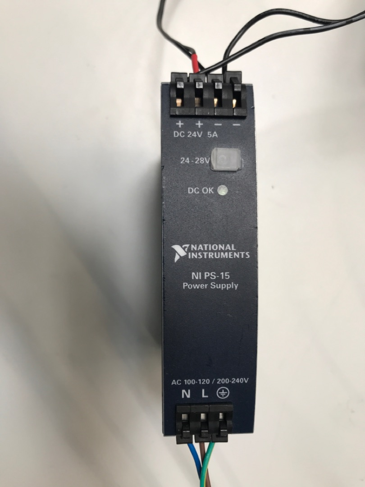

# (PART\*) [English] {-}
# ICOcrt Installation Manual {-}

Installation manual for ICOtronic control system

# Version

This manual was written for SPUs with a Dashboard version v4.0.1.4. If you need an installation manual for an older version see the following link:

[older version](https://github.com/MyTooliT/ICOcrt_Installation/blob/older_than_4_0_1_4/ICOcrt%20Installation%20en.md)

# System Components 						  			

The main components for the ICOtronic control system are shown in the figure below. Those are:

- the Sensory Tool Holder (STH), which features the acceleration sensor, a transceiver and a battery
- the Stationary Transceiver Unit (STU), which is located inside the machine room
- the Signal Processing Unit (SPU), which is connected to the STU via cable and must be located outside the machine room
- the Charging Cradle (CC), which is used for charging the battery of the STH

# Preparations 		

This document describes the installation of the ICOtronic Control System.

## ICOtronic System components 				  			

#### For a full installation the following system components are required: {-}

- Signal Processing Unit – SPU
- Sensory Tool Holder – STH
- Stationary Transceiver Unit - STU (~5m cable length - depending on the machine tool)

## Required materials and tools 		

- Typical core stranded cables: with different colours. Your  maintenance technicians probably have their own conventions. We will  gladly use them.
  Diameter is typically 0,75 mm², which are normal for low voltage. Here we also gladly use the conventions of your  maintenance technicians.
  The cables have to be wired from the  electrical cabinet all the way to the installation location of the SPU.  (max 6 parallel)   
- Ferrules (cable shoes) for the endpoints of the cables
- Cable ties for cable management
- Electrical- and duct tape if something has to be "fixed" 

## Needed tools 				  			

- Cable cutter
- Cable stripper
- Screwdriver
- Engineer's pliers
- Label machine or other methods to label the cables
- Multimeter
- Ethernet cable to connect the SPU and the Laptop
- Laptop with Windows (Windows 7 Servicepack 1; Windows 8.1 Update 1 ; Windows 10) operating system and admin rights

## Needed HR/competences 				  			

- System engineer
- Machine/electrical maintenance technician
- Computer/IT administrator
- Machine operator

## Needed preparatory work at the machine 		

#### Must-Have {-} 		  			

- Control system interface (analogue input module) already integrated
- 230V AC or 24V DC of power supply at the electrical cabinet for the SPU
- Laptop with admin rights and network connection (LAN-Port; no internet required)
- Wiring diagram of the machine
- Existing cable bushing into the machining area

#### Optional {-} 				  			

- Proposals for SPU positioning
- Computer integration and database connection

# Setup and cable installation 		

## Preliminary talk 			  			

Through a talk with the customer before the installation, it should  be clarified if all preconditions for the installation have been met.  Therefore, it is recommended to go through the components of the  "Preparations" part again with the customer.

## Inspection of the machine 				  			

The machine does not need to be taken out of the production operation for the inspection. It is even better if the machine is under  production during inspection. Both the system-engineer and the machine  operator inspect the machine to clarify the following points.

## Condition of the machine and integration possibilities for SPU and STU 						  			

Appropriate locations for the integration of the SPU and STU have to  be found in order to hook up the ICOtronic System to the control system  of the machine. The SPU is typically installed in or around the  electrical cabinet of the machine. Remember that the SPU has to be  powered by 230VAC (50Hz). Moreover, the cables for the controller  signals have to be installed from the electrical cabinet to the SPU.  Depending on the type of machine tool and the way of parameter  adaptation, different numbers of cables will be needed. A typical  installation follows:

Two cables, with a diameter of about 0,75mm², for the digital control signal, sent by a M-command (one digital ground and one digital control signal 24V CPL). One or more of this configuration can be installed in  one sheathed (armoured shielded) cable. Three (or four if different  grounds are used for the analogue control signals) cables with a  diameter of about 0,75 mm² for the analogue machine control (one (or  two) analogue ground and two analogue control signals 0-10V for feed-  and spindle-override). The analogue cables are more susceptible to  possible interferences. Therefore, cable shielding could be important  for these cables.

The STU has to be positioned in the machining area to guarantee a  stable radio connection with the STH. Usually some trial and error is  involved to find a good spot for the STU. Therefore, the STU is mounted  with a magnetically tape and can swiftly be placed at different  locations. Generally, a location around the spindle would be  advantageous. However, in this area there is a higher possibility for  coolant and flying chips. In case of direct coolant and chip contact  with the STU, short-time radio connection instabilities and long-time  mechanical damage can happen. Installation on movable parts could damage the signal cables. Installation in the upper parts of the machining  area are often a good compromise. The front window of the STU should be  visible from the position of the machine operator, because the LEDs on  the STU are used as status indicators for the machine operator.

| LED - STATE                            | MEANING                                        |
| -------------------------------------- | ---------------------------------------------- |
| green LEDs in the corners are blinking | STU has Power and is not connected to a holder |
| green LEDs in the corners are shining  | STU is connected to a holder                   |

A cable bushing into the machining area has to be provided for the  STU to be installed. The position in the machining area can easily be  changed because of the magnetically tape, which is used to install the  STU.

# Installation of the system components 		

## The setup situation of the machine 					  			

To install the system into the machine, the machine must be  accessible in a way that the SPU, STU and all cables can be installed.  It has to be clarified if this causes problems with existing safety  installations. Often ladders and similar equipment will be needed but  cannot be placed anywhere without problems.

## The cable routing 				  			

After finding the positions to install the SPU and STU, the cables  for their connection have to be prepared. The STU is equipped with a 5m  long connection cable, which is not (easily) extendable at the  installation. It is advisable to install the STU first and then route  the cable to the SPU. It is advantageous to place any leftover cable  loops near the STU, but out of the machining area. This helps to easily  reposition the STU if ever needed.

The cables to connect the SPU with the interface module of the  control system have to be prepared during the installation. It is  advisable to get the cables directly from the maintenance crew of the  machine, so that the house intern standards can be easily used.

# Network configuration 				  			

- Laptop with Windows operating system and admin rights, with already installed LabView Runtime
- download link -> http://www.ni.com/download/labview-run-time-engine-2018/7383/en/
  CAUTION: it has to be the 2019 SP1 version
- Ethernet cable to connect the SPU with the Laptop
- IP address of the user end device set. (For details, see the [Dashboard instructions](https://mytoolit.github.io/Dashboard/#software-and-network-settings-for-your-pc))
- Open Dashboard to test the connection

# Integration of the system 		

## Function of the interface 				  			

The machine control starts the closed loop ICOtronic control of the  machine through a digital output. To guarantee that all instances are  working as intended, it is necessary to test the function of the SPU  output before the final connection of the SPU to the interface module.  The right slot of the control signal in the electrical cabinet has to be documented before the installation. Typically, a hat rail module, its  PIN-number and its representation in the control will be named.  Initially, only the module and the slot are of interest. Additionally  the corresponding ground for the module has to be found out.

## Integration of STU and power supply of SPU 					  			

After the STU is properly positioned and the cable routed, the STU  will be connected to the SPU with the Sub-9-D-plug. The power supply for the STU is realized with a Power Injector.

The two Sub-9-D-plugs are to be connected between the STU Sub-9-D-plug and the corresponding Sub-9-D-plug on the SPU (NI 9862). The cable of the Power Injector is plugged into a clamp on the inside of the Power Injector. This cable and the corresponding power supply can be easily changed with another 24V power supply if wanted(For example directly to a power supply inside the machine or the 24V power supply of the SPU). To change the cable you have to screw open the casing of the Power Injector, loosen the cable from the clamp and insert another cable. The polarity of is marked on the PCB near the clamp.

Additionally connect cables from the Power supply unit to the 24V plug of the SPU.  The power supply unit has pins on one side for the 24V output to power  the SPU. On the other side of this module there is the ~230V supply for  the power supply module. If you already have a 24V power supply at the  installation place of the SPU, you can take this supply instead of the  power supply module.

After the SPU is powered and the STU is connected, wait for about  15-30 seconds. The LED1, on the module where the STU is connected,  should start shining green. If not try to reset the power of the SPU and try again.

## Pin mapping of the SPU 						  			

NC... Not Connected, which usually means not used in this application.

#### Analogue OUT (NI 9263): {-}

| PIN    | 0         | 1       | 2             | 3        | 4                | 5           | 6    | 7    | 8    | 9    |
| ------ | --------- | ------- | ------------- | -------- | ---------------- | ----------- | ---- | ---- | ---- | ---- |
| signal | IFT-Value | IFT GND | Feed Override | Feed GND | Spindle Override | Spindle GND | NC   | NC   | NC   | NC   |

The calculated IFT-Value, which represents the stability of the process  regarding chatter, is provided as an analogue signal from 0 - 10 V on  Pin number 0. However, this is just for the possibility of recording the IFT-Value and therefore, Pin 0 and Pin 1 are not connected with the  required analogue interface for the in-process parameter adaption of the control system. The IFT-Value can be scaled and its offset can be  changed in the Dashboard. (For more information about the Dashboard and  its configuration, see the Dashboard user manual)

#### Digital IN & OUT (NI 9375): {-}

| PIN | SIGNAL           | PIN   | SIGNAL         |
|-----|------------------|-------|----------------|
| 1   | DI/ACTIVATE RULE | 19    | DI/CONNECT-ID1 |
| 2   | DI/RECORD        | 20    | DI/CONNECT-ID2 |
| 3   | NC               | 21    | NC             |
| 4   | NC               | 22    | NC             |
| 5   | NC               | 23    | NC             |
| 6   | NC               | 24    | NC             |
| 7   | NC               | 25    | NC             |
| 8   | NC               | 26    | NC             |
| 9   | GND              | 27    | NC             |
| 10  | DO/SYSTEM ACTIV  | 28    | NC             |
| 11  | DO/CONNECTED     | 29    | NC             |
| 12  | DO/RECORDING     | 30    | NC             |
| 13  | DO/RULE ENABLED  | 31    | NC             |
| 14  | DO/INTERFERENCE  | 32    | NC             |
| 15  | NC               | 33    | NC             |
| 16  | NC               | 34    | NC             |
| 17  | NC               | 35    | NC             |
| 18  | GND              | 36    | +24V           |

It is possible to automatically connect too up to 3 predefined toolholders with digital signals on the PIN 19 & 20 of the digital module. (ID3 = ID1 + ID2)

## Digital control signal, SPU input & output 							  			
In cooperation with the machine operator, the digital output of the  machine should be switched on and off. Meanwhile the voltage between the PIN and the corresponding ground is measured. This can be measured  either directly in the electrical cabinet or on the corresponding slots  on the SPU. If the control signal voltage is significantly different to  the expected voltages (0V, 24V) then there is probably something wrong  with the corresponding ground. If the reaction of the PIN is correct,  the cable designation, terminal number etc. should be recorded into the  installation document.

It is advisable to test the function of the signal in a few steps:

1. Through directly setting on the module.
2. Through setting in the control.
3. Through manually setting the corresponding M-commands.

The wiring of the digital outputs of the SPU can be checked directly with the machine control. Therefore you have to start a connection, a recording, etc. via the dashboard. Then check if the signals gotten by the machine control are set high like they should be.

## Analogue control signal, SPU output 			

The external analogue signals to control the machine tool overrides  are created by the SPU. The voltage range is 0-10V and corresponds to an override of 0-100%. The larger the voltage of the signal the larger the reduction of feed and/or spindle speed. The resulting feed and spindle  speed is generated by the multiplication of the SPU output and the value set at the machine via the potentiometer.

It is advisable to test the process in a few steps:

First, disconnect the cables for feed and spindle overrides by removing the terminal block of the NI 9263 module from the SPU.
Set the mode in the Dashboard to "direct output" (For more information  about the Dashboard and its configuration, see the Dashboard user  manual). Set the overrides to 40% feed and 50% spindle speed and measure the voltages on the pins of the NI 9263 module from the SPU. The  results should be 6V feed and 5V spindle. After that, the removed  terminal block of the NI 9263 AO module can be inserted again. Measure  the voltages on the terminal in the cabinet of the machine tool with the same Dashboard configuration. The results should also be 6V feed and 5V spindle, check if they are correct.
If this test was a success, check all the variables' values in the control system, which are affected by the SPU output values.

Finally there should be made a cut without removing materials, while  the overrides are changed in the dashboard. A change of the values  should occur instantly and can be checked via the corresponding values  in the control system.
Then the SPU should be set back in "watch"  mode in the Dashboard (more information about the usage of the Dashboard is shown in the Dashboard user manual).

Now you should be able to find and connect with a sensory tool holder through the Dashboard. Try to shake the tool holder and check if the  IFT-Value in the dashboard is changing. 

Now you can put the holder into the spindle. Move the spindle to  different positions inside the machining area to test if the connection  is given in the whole area. If not try positioning the STU to a  different place.

Now the system is fully installed and usable.

# Definition of the LEDs of ICOtronic System

## STH:

The STH has two green LEDs. The one on the “larger” PCB is the charging LED. It is shining when the holder is placed in the charging cradle. (Normally this LED is showing down in the CC and is hard to see.)

The other LED is on the “smaller” PCB. This LED is shining or blinking when the holder is connected to a STU.

## STU:

The STU has four green and red LEDs in the corners. Additionally the STU has two power-LEDs and three CAN-LEDs. When the STU is being connected to power, all LED are shining for about 1 second and then show there normal behaviour.

The CAN-LEDs are blinking and shining dependent on CAN-Messages sent or received. The two power LEDs show if the STU is connected to power.
When the STU is connected to power and not connected to a STH, the green LEDs in the corners are blinking. The red ones are off. When a STH is connected to the STU the green LEDs stop blinking and start shining. The red ones still do not shine. When the STH is streaming data to the STU for processing, the red LED can start blinking in an irregular interval symbolizing that a data packet was lost.

## CC:

The CC has two different types of LEDs. The first one is the only LED with another colour than the other ones. This LED is shining when the CC is connected to a power supply and working.

The rest of the LEDs has another colour than the first one. These LEDs symbolize the momentary used charging current. The more LED shine the more current is used to charge the STH. If a STH is placed into the CC and all of these LEDs are off, the STH is charged to the maximum.

## SPU:

The SPU has multiple LEDs. The LEDs on the top left of the SPU are status LEDs showing if the SPU is connected to power and so on. When a LAN-cable is connected and the other side of the LAN-cable is connected to a network or computer, the LEDs at the LAN-port start blinking. On the first module of the SPU, the CAN-module, there are two LEDs. These LED show if the CAN connection is working. After booting the SPU, it takes about 30 seconds for the LEDs to start shining. If not reboot the SPU or control the CAN connection.