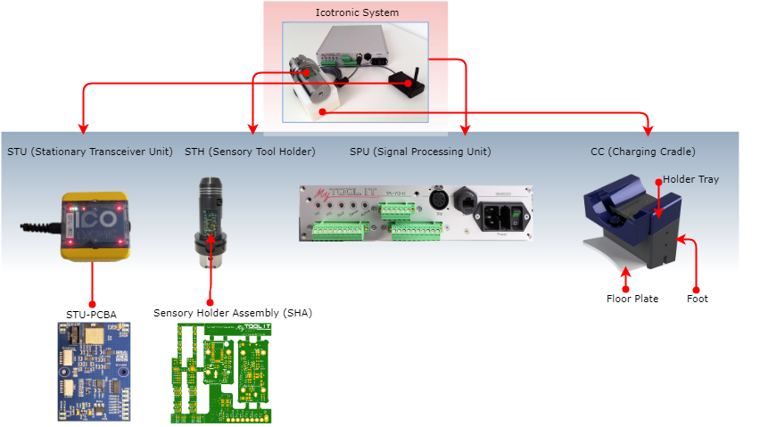

# Installation de

Installationsanleitung

## Vorbereitung 		

###		ICOtronic System-Komponenten 			  			

#### Für eine Vollinstallation werden folgende Systemkomponenten benötigt:

- Signal Processing Unit – SPU
- Sensory Tool Holder – STH
- Stationary Tranciever Unit - STU (5m Länge)
- Optional Verlängerungskabel für STU (7m Länge)

### Benötigtes Verbrauchsmaterial 				  			

- Kabel in verschiedenen Farben: Die Haustechnik hat hier vermutlich  Konventionen denen wir uns gerne beugen. Der Querschnitt beträgt  üblicherweise 0,75 mm^2 welche nur Niederspannung führen. Daher kann  auch hier gerne auf interne Konventionen Rücksicht genommen werden. Die  Kabel müssen aus dem Schaltschrank bis zu dem Aufstellort der SPU  reichen (max 6 parallel ).      
- Aderendhülsenset
- Kabelbinder
- Isolier- und Klebeband, falls wir was „passend“ machen müssen    

### Benötigtes Werkzeug 				  			

- Seitenschneider
- Abisolierzange
- Schraubenzieher
- Kombi-Zange
- Beschriftungsgerät oder Klebe-Label um die Kabel zu kennzeichnen
- Multimeter
- Ethernetkabel um die My Tool IT Box mit dem Laptop zu verbinden
- Laptop mit Adminberechtigung

### Notwendige HR/ Kompetenzen 		  			

- System-Ingenieur
- InstandhaltungMaschinen-Elektriker
- EDV-Admin
- Maschinenführer

### Notwendige Vorbereitungsarbeiten an der Maschine 		

#### Muss 					

- Steuerungseingriff in an der Maschine integriert
- 230V beim Schaltschrank für SPU
- Laptop mit Admin-Rechten und Netzwerkzugang
- Schaltpläne der Maschine
- Kabeldurchgang in Bearbeitungsraum vefügbar

#### Optional 		  			

- Vorschläge für SPU Position
- EDV Integration und Datenbankanbindung

## System Komponenten 		

## Aufstellung und Verkabelung 		

### Vorbesprechung 		

Vor der Installation soll im Gespräch mit dem Kunden abgeklärt werden ob alle notwendigen Vorbedingungen erfüllt sind. Dazu empfiehlt es sich die Benötigten Komponenten aus dem Abschnitt “Vorbereitung” nochmals  gemeinsam durchzugehen.

### Begutachten der Maschine 					  			

Zur Begutachtung muss die Maschine nicht aus dem Produktivbetrieb  genommen werden. Es ist sogar förderlich wenn die Maschine gerade  typisch verwendet wird. Der System-Ingenieur besichtigt mit dem  Maschinenführer die Maschine um folgende Punkte abzuklären.

### Beschaffenheit der Maschine und Integrationsmöglichkeiten für die SPU und STU 						  			

Um das MyTooliT System in die Steuerung einer Maschine zu integrieren müssen für SPU und STU geeignete Aufstellplätze gefunden werden. Die  SPU wird typischerweise in, oder rund um den Schaltschrank der Maschine  angebracht Dabei ist zu beachten, dass die SPU mit 230VAC versorgt  werden muss. Weiters müssen für den Steuerungseingriff Kabel aus dem  Schaltschrank zu der SPU geführt werden. Abhängig vom Aufbau der  Maschine und Art des Eingriffes werden dafür unterschiedlich viele  elektrische Verbindungen benötigt. Eine typische Ausführung könnte sein:

Zwei Adern mit etwa 0,75mm2 für das digitale  Eingriffs-Signal ausgelöst durch M-Befehl (Einmal digitale Masse, einmal digitales Steuersignal 24V CPL). Eine oder mehrere solcher  Konfigurationen können in einer Mantelleitung geführt werden. Drei Adern mit etwa 0,75mm2 für den analogen Maschinen-Eingriff (Einmal analoge Masse und zwei analoge Steuersignale 0-10V für  Vorschub-/Spindel-Override). Die Analogen Leitungen sind generell  anfälliger auf Störungen warum hier Schirmung wichtig sein kann.

Die STU muss im Bearbeitungsraum der Maschine angebracht werden um  eine stabile Funkverbindung mit dem STH zu gewährleisten. Einen  günstigen Platz für die STU auszusuchen erfordert oft etwas probieren.  Daher ist die STU nur magnetisch befestigt und kann schnell manipuliert  werden. Generell wäre ein Montageort nahe der Spindel günstig. Jedoch  kommt es dort auch oft zu vermehrtem Span-und Kühlmittel-Aufkommen.  Dieses kann kurzfristig zu instabilen Funkverbindungen führen, sowie  längerfristig zu Beschädigungen der STU. Montage auf beweglichen Teilen  kann zu Problemen mit dem Anschlusskabel führen. Montagen im oberen  Bereich des Maschinenraums sind oft ein guter Kompromiss. Das Frontglas  sollte bevorzugt durch das Maschinenfenster einsehbar sein da die LEDs  als Status Indikator verwendet werden.

Die Kabeldurchführung in den Bearbeitungsraum der Maschine muss  vorhanden sein, da sonst die STU nicht platziert werden kann. Die  Position im Bearbeitungsraum kann leicht verändert werden da die STU nur magnetisch montiert wird.

## Montage der Systemkomponenten 		

### Die Aufstell-Situation der Maschine 				  			

Die Maschine muss für eine Installation soweit zugänglich sein, dass  alle Kabel, SPU und STU montiert werden können. Es ist abzuklären ob das mit irgendwelchen Sicherheitseinrichtungen in Konflikt steht. Oft  werden auch Leitern oder ähnliches benötigt, können jedoch nicht ohne  weiteres aufgestellt werden.

### Die Kabelführung 					  			

Wenn die Position von SPU und STU festgelegt wurde, müssen die Kabel  für die jeweiligen Verbindungen vorbereitet werden. Die STU kommt mit  einem 5m Anschlusskabel welches nicht (leicht) vor Ort verlängert werden kann. Es ist günstig mit der Platzierung der STU zu beginnen und das  Kabel zur SPU zu fädeln. Jedoch sollte eine Kabelschleife nahe der STU,  aber außerhalb des Bearbeitungsraumes, verbleiben. So kann man die  Position der STU im Nachhinein leichter wieder verändern.

Die Kabel für die Anbindung der Steuerung an die SPU müssen vor-ort  konfektioniert werden. Es empfiehlt sich diese Kabel direkt von der  Instandhaltung bereitstellen zu lassen da damit die Konventionen des  Betriebes ganz von selbst berücksichtigt werden.

## Netzwerkkonfiguration 						  				

- Laptop mit Windows Betriebssystem und Admin-Berechtigung, sowie bereits installierter LabView Runtime; downloadlink → http://www.ni.com/download/labview-run-time-engine-2018/7383/en/) 
  ACHTUNG es mus unbedingt sie Runtime 2018 SP1 installiert werden
- Ethernetkabel um die SPU Box mit dem Laptop zu verbinden
- IP Adresse beim User Endgerät auf XXX setzen.
- Dashboard öffnen um Verbindung zu überprüfen

## Anbinden der Steuerung 		

### Funktion der Schnittstelle 				  			

Die Maschinensteuerung schaltet die Regelung der Maschine durch einen digitalen Ausgang ein. Um sicherzustellen, dass alle Instanzen  funktionieren, sollte die Funktion des Ausganges vor dem finalen  Anbinden verifiziert werden.
Der richtige Steckplatz des  Steuersignals im Schaltschrank muss von der Installation dokumentiert  sein. Typischerweise wird ein Hutschienen-Modul, dessen Pin sowie dessen Repräsentanz in der Steuerung im Schaltplan genannt. Vorerst sind nur  das Modul und der Steckplatz von Interesse. Außerdem muss aus dem  Schaltplan die zugehörige Bezugsmasse für dieses Modul abgelesen werden.

### Pinbelegung der SPU 		

#### **Analog OUT:**

| Pin      | 1    | 2                     | 3                     | 4         | 5    | 6    |
| :------- | :--- | :-------------------- | :-------------------- | :-------- | :--- | :--- |
| Belegung | GND  | Vorschub-Override     | Spindel-Override      | IFT-Value | NB   | GND  |
| Wert     | 0    | 100%=0V,0%=10V,40%=6V | 100%=0V,0%=10V,40%=6V | IFT+=V+   | NB   | 0    |

#### **Digital IN:**

| PIN      | 1    | 2        | 3    | 4    | 5    | 6    | 7    | 8    | 9    | 10   |
| :------- | :--- | :------- | :--- | :--- | :--- | :--- | :--- | :--- | :--- | :--- |
| Belegung | GND  | Eingriff | NB   | NB   | NB   | NB   | NB   | NB   | NB   | GND  |

### Digitale Steuersignale, SPU Eingang 					

In Absprache mit dem Maschinenbediener soll der zu-verifizierende  Ausgang wechselweise Ein- und Ausgeschaltet werden. Dabei überprüft man  die Spannung zwischen dem Steckplatz und der Bezugsmasse. Das kann  entweder direkt am Schaltschrank oder an der von der SPU-getrennten  Klemmleiste erfolgen. Sollte die Steuerspannung von den erwarteten  Spannungsniveaus (0V, 24V) signifikant abweichen ist vermutlich etwas  mit der Bezugsmasse nicht in Ordnung. Wenn die Reaktion korrekt erfolgt, sollten die Kabelbezeichnungen, Klemmen-Nummern usw. in der  Installationsdokumentation vermerkt werden.

Wird die SPU in einen Regelmodus versetzt und die Eingriffsschwelle  auf 0.0 reduziert sollte das Aktiv LED dem Pegel des Steuersignals  folgen. 
Es empfielt sich die Funktion dieses Signals ins Stufen zu prüfen:

1. Durch direktes Schreiben auf das Modul.
2. Durch schreiben der Variable in der Steuerung.
3. Durch manelles setzten der entsprechenden M-Befehle.

### Analoge Steuersignale, SPU Ausgang 				

Die Analogen Steuersignale zum einstellen des Maschineneingriffs  werden von der SPU generiert. Die Spannungswerte reichen von 0-10V und  entsprechen einer Reduktion des Overrides von 0-100%. Also je höher die  Spannung, desto stärker die Reduktion von Vorschub bzw. Spindel. Der  Wert in der Steuerung entspricht hierbei einer Multiplikation von Poti  und SPU Ausgabe.

Es empfielt sich wieder stufenweise vorzugehen:
Eine leere Klemme  in die SPU einsetzten, im “direct troughput” Modus einen override von  40% Vorschub und 50% Spindel einzustellen und die Spannungen an den  entsprechenden Klemmen messen. Das Resultat sollte 6V Vorschub und 5V  Spindel sein.
Wenn die Spannungen richtig sind, die leere Klemme gegen die belegte tauschen.
Die Werte welche die Analogkkarten liefern in der Steuerung anzeigen, und überprüfen ob diese entspechen.
Wenn dieser Schritt erfolgreich ist sollte man sich alle Variablen in der  Steuerung ansehen welche von diesen Variablen abgeleitet werden.
Final sollte ein “Luftschnitt” druchgeführt während dessen der Override via  der Variablen config.Override_Vorschub ?? und config.Overrride_Spindle  ?? verändert wird. Die Einwirkung sollte unmittelbar merkbar sein und  kann über die Anzeige an der Steuerung verifiziert werden.
Danach sollte die SPU wieder in den “Idle” Modus versetzt werden.

### Anbinden von STU und Halter 					  			

Nach dem die STU befestigt und das Kabel verlegt wurde, wird sie mit  der SPU via XLR-Stecker verbundnen. Die STU aktiviert den Halter jedoch  erst wenn ein Enable-Signal seitens der SPU gegeben wird. Der Modus  “Watch” erzeugt dieses enable-signal ohne Maschineneingriff, warum er  sich besonders zum testen eignet.
Wenn in den Modus “Watch”  gewechselt wird während sich der Halter im Empfangsbereich der STU  befindet, sollten sich die Einheiten verbinden. Um das anzuzeigen  schalten die LED in der STU ein und der Halter blinkt. Durch kräftiges  Schütteln des Halters sollte sich der Stabilitätswert leicht erhöhen.

Ein Wechsel der Modi kann nur über den Modus Idle erfolgen. Dieser  muss durch den Button Update aktiviert werden. Danach ist ein Wechsel  auf andere Modi möglich. (Genauere Informationen siehe Dashboard  Anleitung)